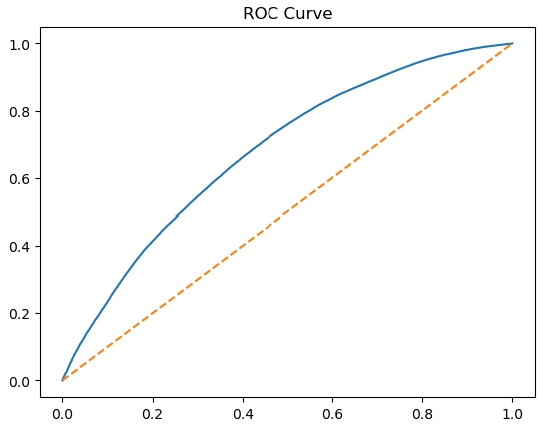
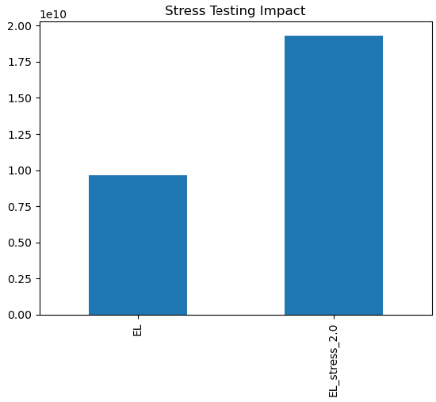

# Credit Risk Modeling Project (PD, EL, Stress Testing)

## Overview
This project builds a Credit Risk Probability of Default (PD) model using Logistic Regression on retail lending data.  
It estimates borrower default risk, computes Expected Loss (EL), and evaluates portfolio risk under stress scenarios using a standard credit risk framework.

## Objective
- Predict Probability of Default (PD) for borrowers  
- Estimate Expected Loss (EL) using:  
  EL = PD × LGD × EAD  
- Identify key credit risk drivers  
- Perform stress testing under adverse portfolio conditions  

## Dataset Features
- loan_amnt: Loan amount  
- int_rate: Interest rate  
- annual_inc: Annual income  
- dti: Debt-to-income ratio  
- loan_status: Target variable (default / non-default)  

## Methodology

### Data Preprocessing
- Handled missing values  
- Converted interest rate to numeric format  
- Selected key financial variables  

### Target Definition
Default classified as:
- Charged Off  
- Default  
- Late (31–120 days)  

### Model
- Logistic Regression classifier  
- Train/test split: 80/20  
- Feature scaling applied  

## Evaluation
- ROC-AUC Score: 0.680  
- ROC curve used for classification performance assessment  

The model demonstrates moderate predictive power consistent with an interpretable baseline credit risk model.

## Risk Framework

### Probability of Default (PD)
Model outputs borrower-level default probabilities.

### Loss Given Default (LGD)
- Assumed constant: 0.6  

### Exposure at Default (EAD)
- Equal to loan principal (loan_amnt)

## Key Results

### Feature Importance (Logistic Regression Coefficients)
- int_rate: 0.612  
- loan_amnt: 0.039  
- dti: 0.029  
- annual_inc: -0.256  

Key insight: Interest rate is the strongest driver of default risk.

### Expected Loss Example (Loan-level)
- PD: 0.487, LGD: 0.6, EAD: 3600 → EL: 1051.47  
- PD: 0.446, LGD: 0.6, EAD: 24700 → EL: 6609.42  
- PD: 0.728, LGD: 0.6, EAD: 10400 → EL: 4540.16  

### Risk Segmentation
- Low-risk borrowers: ~2.8% default rate  
- High-risk borrowers: ~26%+ default rate  

## Expected Loss Framework
EL = PD × LGD × EAD  

Enables loan-level credit risk quantification and portfolio aggregation.

## Stress Testing
Portfolio evaluated under PD shock scenarios:
- 1.2x  
- 1.5x  
- 2.0x  

Expected loss increases significantly under stress scenarios, showing portfolio sensitivity to macro deterioration.

## Key Insights
- Interest rate is the strongest predictor of default  
- Higher income reduces default risk  
- Higher DTI increases risk  
- Loan amount has weaker predictive power  
- Model is interpretable and aligned with credit risk intuition  

## Future Improvements
- WOE / IV feature engineering  
- Basel scorecard (300–850 scaling)  
- Model calibration improvements  
- XGBoost / Random Forest models  
- Portfolio segmentation analysis  

## Tools Used
- Python  
- Pandas  
- NumPy  
- Scikit-learn  
- Matplotlib  

## Note
This project follows a Basel-style credit risk framework and demonstrates applied modeling and interpretability for credit risk analysis.

## Results

### ROC Curve

### Stress Testing Results
